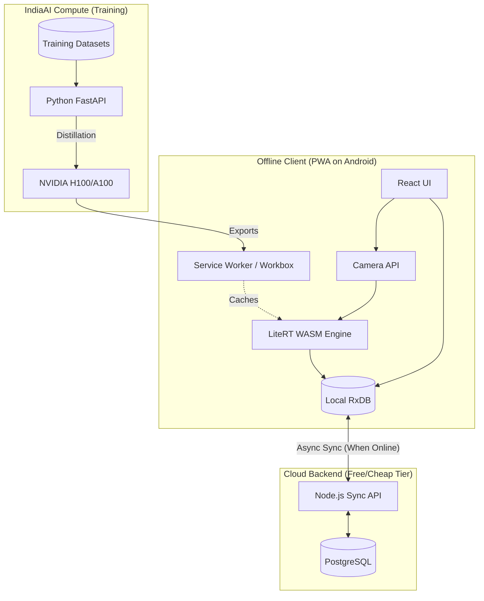

# Technical Design Document: Kisan-Trace MVP

## Executive Summary

**System:** Kisan-Trace
**Version:** MVP 1.0
**Architecture Pattern:** Edge-heavy Microservices (Offline-First PWA)
**Estimated Effort:** 10–12 Weeks
**Primary Goal:** Deliver high-accuracy, on-device AI inference for crop disease diagnosis with zero reliance on real-time internet connectivity.

---

## 1. Tech Stack Decisions

### 1.1 Frontend (Client Layer)
We need a framework that can build a highly performant, installable Progressive Web App (PWA) with excellent WASM support for the AI model.

**Primary Recommendation: React + Vite + Workbox**
- **Why it's perfect:** Vite provides an incredibly fast build system and excellent WASM support out-of-the-box. Workbox simplifies the complex Service Worker logic needed to cache a 5MB AI model for offline use. React's ecosystem has great wrappers for camera access.
- **Alternatives Considered:**
  - *Next.js:* Pros: Great ecosystem. Cons: Overkill for a pure Single Page Application (SPA) where 100% of the core logic must run offline. Server-Side Rendering (SSR) adds unnecessary complexity here.
  - *Vanilla JS + HTML:* Pros: Smallest bundle. Cons: UI state management for camera loops and IndexedDB sync becomes messy.
- **Trade-offs:** React adds a small baseline payload (~40kb), but the developer velocity and component ecosystem make it worth it.

### 1.2 Edge AI Inference
We must run a neural network entirely in the browser on low-RAM devices.

**Primary Recommendation: LiteRT (TFLite) via WASM (LiteRT.js)**
- **Why it's perfect:** Google's LiteRT is optimized for mobile CPUs via XNNPACK. Using a quantized (INT8) MobileNetV3 model in `tflite` format keeps the download size under 5MB and inference time under 4 seconds.
- **Alternatives Considered:**
  - *ONNX.js / ONNX Runtime Web:* Pros: Great framework interoperability. Cons: Slightly larger runtime bundle compared to LiteRT.
  - *TensorFlow.js (tfjs):* Pros: Easy React integration. Cons: Often slower and memory-heavy on low-end Android compared to LiteRT WASM.
- **Trade-offs:** We cannot use WebGPU/WebNN everywhere yet, so we must rely on CPU (WASM) fallback, which is slower but guaranteed to work on $60 Android phones.

### 1.3 Offline Data Synchronization
We need to store scan metadata locally and sync to the cloud when internet is available.

**Primary Recommendation: RxDB (Local IndexedDB) + Node.js (Server)**
- **Why it's perfect:** RxDB provides a reactive local database that automatically handles offline/online state and syncs via WebSockets or HTTP polling to a custom backend. It abstracts away the pain of raw IndexedDB.
- **Alternatives Considered:**
  - *PowerSync + PostgreSQL:* Pros: Enterprise-grade SQLite to Postgres sync. Cons: Might be overkill and expensive for simple metadata logs in an MVP.
  - *Raw IndexedDB / Dexie.js:* Pros: Zero dependencies. Cons: Writing custom background sync and conflict resolution logic is highly error-prone.
- **Trade-offs:** RxDB has a slight learning curve, but it guarantees data consistency. We will use a "Last Writer Wins" (LWW) strategy for MVP since single users own their scan data.

### 1.4 Backend API & Training
The backend is only for telemetry, scan history, and heavy model retraining.

**Primary Recommendation: Node.js/Express (API) + Python/FastAPI (ML Service) on IndiaAI Compute**
- **Why it's perfect:** Express is lightweight and perfect for handling JSON syncs. Python/FastAPI is the industry standard for wrapping ML training scripts. Training the Teacher model (ViT) happens on IndiaAI's subsidized GPUs (₹67/hr), while the distilled student model is served statically.
- **Alternatives Considered:**
  - *Monolithic Python (Django):* Pros: Single codebase. Cons: Async IO for thousands of intermittent syncs is handled better by Node.js.
- **Trade-offs:** Managing two backend microservices adds deployment complexity, but separates the cheap API layer from the expensive GPU layer.

---

## 2. Architecture Overview

### High-Level Architecture



### Application Folder Structure

```
kisan-trace/
├── client/                 # PWA Frontend
│   ├── public/             # Static assets, models (.tflite), manifest.json
│   ├── src/
│   │   ├── components/     # UI Components (Scanner, ReportCard)
│   │   ├── ai/             # LiteRT WASM integration logic
│   │   ├── db/             # RxDB schemas and sync setup
│   │   └── sw.js           # Custom Service Worker (Workbox)
│   └── vite.config.js
├── server-api/             # Node.js Metadata Backend
│   ├── src/
│   │   ├── routes/         # Sync endpoints
│   │   └── db/             # Postgres connection (Prisma/Drizzle)
│   └── Dockerfile
└── ml-pipeline/            # Python Training/Distillation
    ├── data_loaders/       # Paddy Doctor, Mendeley parsers
    ├── models/             # PyTorch/TF scripts for Teacher/Student
    └── export/             # Scripts to quantize to INT8 TFLite
```

---

## 3. Database Schema (PostgreSQL)

We will keep the schema simple to minimize sync conflicts.

```sql
-- Users Table (Farmers/Agents)
CREATE TABLE users (
    id UUID PRIMARY KEY DEFAULT gen_random_uuid(),
    phone_number VARCHAR(20) UNIQUE, -- Primary auth for rural users
    locale VARCHAR(10) DEFAULT 'hi-IN',
    created_at TIMESTAMP DEFAULT CURRENT_TIMESTAMP
);

-- Scans Table (Metadata only, no images in MVP to save bandwidth)
CREATE TABLE scans (
    id UUID PRIMARY KEY, -- Generated locally via UUIDv7 for deterministic sorting
    user_id UUID REFERENCES users(id),
    crop_type VARCHAR(50) NOT NULL,
    predicted_disease VARCHAR(100),
    confidence_score DECIMAL(5,4),
    severity VARCHAR(20),
    scanned_at TIMESTAMP NOT NULL, -- When it was actually scanned offline
    synced_at TIMESTAMP DEFAULT CURRENT_TIMESTAMP, -- When it hit the server
    latitude DECIMAL(10,8),  -- Optional: GPS for mapping outbreaks
    longitude DECIMAL(10,8)
);

CREATE INDEX idx_scans_user ON scans(user_id);
CREATE INDEX idx_scans_time ON scans(scanned_at);
```

---

## 4. Feature Implementation Details

### Feature 1: Offline Edge AI Leaf Scanner

**Workflow:**
1. User opens camera via HTML5 `<input type="file" accept="image/*" capture="environment">` or WebRTC `getUserMedia`.
2. Image is drawn to a `<canvas>` and resized to 224x224 (MobileNetV3 input size).
3. Image data is passed to `LiteRT.js`.
4. The `model.tflite` (cached via Service Worker) runs inference.
5. Top prediction is returned.

**Performance Constraints:**
- Must use Web Workers to prevent the inference loop from freezing the React UI thread.

### Feature 2: Offline Sync Mechanism

**Workflow:**
1. Inference result is saved to local RxDB instance.
2. RxDB replication plugin listens for `window.navigator.onLine`.
3. When online, RxDB pushes un-synced documents to `POST /api/sync/push`.
4. Server acknowledges receipt, local DB marks as synced.
5. If conflict arises (rare for append-only logs), server timestamp wins.

---

## 5. Deployment Plan & Cost Breakdown

### Environments
1. **Frontend PWA:** Deployed on **Vercel** or **Cloudflare Pages**.
   - *Cost:* Free tier (unlimited edge bandwidth for static assets).
2. **Node.js API & Database:** Deployed on **Railway** or **Render**.
   - *Cost:* Free tier or ~$5/month for basic Postgres + Node runtime.
3. **Model Training:** **IndiaAI Compute Portal**.
   - *Cost:* ~₹67/hour. Estimated 50 hours for training Teacher + Distillation = ~₹3,500 one-time.

### Deployment Steps (Production)
1. Train model on IndiaAI.
2. Export `model_quantized.tflite` (<5MB).
3. Place model in `/client/public/models/`.
4. Push code to GitHub.
5. Cloudflare Pages auto-builds React app.
6. Service Worker pre-caches the model on user's first visit.

---

## 6. Edge Cases & Resilience Engineering

Given the harsh target environment (low-end devices, extreme temperatures, zero connectivity), the following edge cases must be explicitly handled.

### 6.1 Device Memory Limits (OOM Crashes)
**The Edge Case:** A farmer's ₹5,000 Android phone has 2GB RAM, but the OS uses 1.5GB. When the 5MB WASM model loads and requests contiguous memory, the browser tab crashes silently without an error message.
**Mitigation Strategy:**
- Implement a memory-profiling pre-check using `navigator.deviceMemory`.
- If memory is < 2GB, load an aggressively quantized (e.g., INT8/16 hybrid) 2MB fallback model instead of the standard 5MB model.
- **Crucial:** Execute all inference within a dedicated Web Worker to isolate the memory allocation and processing from the main UI thread, ensuring the app remains responsive.

### 6.2 Camera API Quirks (Hardware Constraints)
**The Edge Case:** Cheap phones often have multiple lenses (macro, depth) but misreport them to the `getUserMedia` API. The app accidentally selects the macro lens, leading to blurry, out-of-focus leaf captures that destroy model accuracy.
**Mitigation Strategy:**
- Implement manual focus prompts and a bounding-box overlay to force the user to center the leaf.
- Add a pre-inference blur-detection algorithm (e.g., a fast Laplacian variance check in lightweight JavaScript). If the variance is too low (blurry), reject the image instantly before passing it to the heavy AI model.

### 6.3 Storage Quota Exceeded (Silent Eviction)
**The Edge Case:** The phone's storage is 99% full (common due to WhatsApp media). The Android WebView's storage manager silently evicts the PWA's cached AI model or IndexedDB data under its LRU (Least Recently Used) policy to free up space.
**Mitigation Strategy:**
- Use the Storage API's `navigator.storage.persist()` immediately after installation to request persistent storage, preventing silent eviction.
- Implement aggressive pruning: if local storage is >90% full, automatically delete synced scan metadata older than 7 days, prioritizing the retention of the offline model and un-synced data.

### 6.4 Intermittent Connectivity (The "Flapping" Signal)
**The Edge Case:** A farmer walks out of the field, and the signal jumps between EDGE (2G), 3G, and offline every few seconds. The RxDB sync process starts pushing a payload, gets interrupted, retries, and creates duplicate entries or drains the battery rapidly.
**Mitigation Strategy:**
- Implement **Exponential Backoff with Jitter** for sync retries.
- Do not attempt sync on 2G/EDGE networks (check `navigator.connection.effectiveType`). Wait for '3g' or '4g'.
- Ensure the backend API is **idempotent**: the client generates a `UUIDv7` for each scan *before* syncing. If the server receives a payload it already has, it simply returns `200 OK` without creating a duplicate row.

### 6.5 Model Drift & Staleness
**The Edge Case:** The farmer installs the PWA and never connects to Wi-Fi/4G for 6 months. A new disease variant emerges. The offline model is dangerously outdated and misdiagnoses the new disease.
**Mitigation Strategy:**
- Implement a "Model Staleness Warning". If `Date.now() - model.lastUpdated > 90 days`, display a permanent UI banner advising the farmer that accuracy may be reduced and they should connect to the internet for a 5MB background update.

### 6.6 Thermal Throttling (Overheating Devices)
**The Edge Case:** It's 42°C (107°F) in an Indian summer field. Loading a neural network causes the CPU to thermal throttle. Inference time spikes from 4 seconds to 20 seconds, and the user thinks the app is frozen.
**Mitigation Strategy:**
- Implement a progress-based loading UI instead of a static spinner.
- If inference takes longer than 8 seconds, show a specific message: "Phone is running warm, analysis may take a bit longer."
- XNNPACK manages most thread yielding, but ensuring UI updates between heavy array manipulations helps the app stay responsive.

### 6.7 Service Worker Update Conflicts
**The Edge Case:** We push a critical bug fix. The Service Worker downloads the new assets, but because the farmer keeps the app tab open in the background indefinitely, the new Service Worker remains in the "waiting" phase and the app never updates.
**Mitigation Strategy:**
- Implement a "Skip Waiting" prompt. When the Service Worker detects a new version, display a full-screen, non-dismissible modal: "A critical update is ready. Tap to restart." This forces the unregistration of the old SW and reloads the page.

---

## 7. Definition of Technical Success

The technical architecture is validated when:
- The PWA loads in airplane mode.
- The camera can capture a leaf and return a diagnosis in under 4 seconds while still in airplane mode.
- Reconnecting to Wi-Fi automatically pushes the scan metadata to the PostgreSQL database without manual user intervention.
- The total application size (HTML/JS + Model) is under 8MB.

---
*Technical Design for: Kisan-Trace*
*Approach: AI-Assisted Full-Stack*
*Estimated Time to MVP: 10–12 Weeks*
*Estimated Operating Cost: <$10/month*
